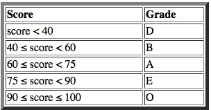

Welcome to Day 12! Check out [this video](https://www.youtube.com/watch?v=wlA66hZ4Z74&feature=youtu.be) reviewing inheritance, or just jump right into the problem.

You are given two classes, Student and Grade, where Student is the base class and Grade is the derived class. Completed code for Student and stub code for Grade are provided for you in the editor. Note that Grade inherits all the properties of Student.

Complete the Grade class by writing a class constructor (Grade(String,String,int,int)) and a char calculate() method. The calculate method should return the character representative of a Student's *Grade. Score as defined in this chart: 

#Input Format

Input is already handled for you by the code pre-filled in the editor. There are 4 lines of input containing first name, last name, phone, and score, respectively.

#Constraints 

4≤|first name|,|last name|≤10 

phone contains exactly 7 digits 

1≤score≤100

#Output Format

Output is already handled for you by the code pre-filled in the editor. Your output will be correct if your Grade class constructor and calculate method are properly written.

#Sample Input

 Heraldo

 Memelli

 8135627

 90

#Sample Output

 First Name: Heraldo

 Last Name: Memelli

 Phone: 8135627

 Grade: O